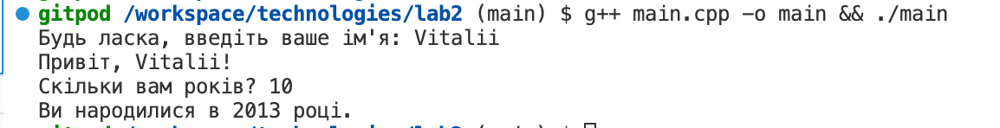

# Програма для визначення року народження

Ця програма запитує ім'я та вік користувача і обчислює рік його народження. Результат виводиться на екран.

## Вимоги

Програма написана на мові програмування C++ і використовує стандартну бібліотеку для роботи зі стрічками та ввід-вивідом даних.

## Використання

1. Після запуску програма запитає ваше ім'я. Введіть ваше ім'я та натисніть Enter.
2. Потім програма запитає ваш вік. Введіть свій вік та натисніть Enter.
3. Результат виведеться на екрані, показуючи рік вашого народження.

## Приклад виконання

